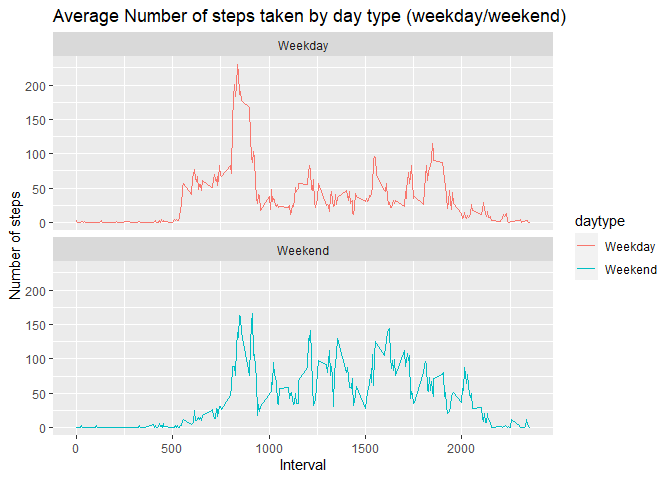

## Read and check the data

1.Reading in the dataset 

```r
mydata<-read.csv("activity.csv")
```
2.Checking the data

```r
head(mydata, n=10)
```

```
##    steps       date interval
## 1     NA 2012-10-01        0
## 2     NA 2012-10-01        5
## 3     NA 2012-10-01       10
## 4     NA 2012-10-01       15
## 5     NA 2012-10-01       20
## 6     NA 2012-10-01       25
## 7     NA 2012-10-01       30
## 8     NA 2012-10-01       35
## 9     NA 2012-10-01       40
## 10    NA 2012-10-01       45
```

```r
summary(mydata)
```

```
##      steps            date              interval     
##  Min.   :  0.00   Length:17568       Min.   :   0.0  
##  1st Qu.:  0.00   Class :character   1st Qu.: 588.8  
##  Median :  0.00   Mode  :character   Median :1177.5  
##  Mean   : 37.38                      Mean   :1177.5  
##  3rd Qu.: 12.00                      3rd Qu.:1766.2  
##  Max.   :806.00                      Max.   :2355.0  
##  NA's   :2304
```

## Plot the total number of steps taken each day

1.Aggregte steps by date

```r
TotalsPerDay <- aggregate(mydata$steps, list(mydata$date), FUN=sum)
colnames(TotalsPerDay) <- c("Date", "Steps")
head(TotalsPerDay, n=10)
```

```
##          Date Steps
## 1  2012-10-01    NA
## 2  2012-10-02   126
## 3  2012-10-03 11352
## 4  2012-10-04 12116
## 5  2012-10-05 13294
## 6  2012-10-06 15420
## 7  2012-10-07 11015
## 8  2012-10-08    NA
## 9  2012-10-09 12811
## 10 2012-10-10  9900
```

2.Plot histogram of the total number of steps taken each day

```r
install.packages(
   "ggplot2",
   repos = c("http://rstudio.org/_packages","http://cran.rstudio.com"),
   dependencies=TRUE
)
```

```
## package 'ggplot2' successfully unpacked and MD5 sums checked
## 
## The downloaded binary packages are in
## 	C:\Users\x\AppData\Local\Temp\RtmpUTifqt\downloaded_packages
```

```r
library(ggplot2)

g <- ggplot(TotalsPerDay, aes(Steps))
g <- g + geom_histogram(boundary=0, binwidth=1000,col="black", fill="lightblue") + 
         ggtitle("Total steps per day") + xlab("Steps") + ylab("Frequency")
print(g)
```

<!-- -->

## Mean and median number of steps taken each day
1.Calculate and report the mean

```r
as.integer(mean(TotalsPerDay$Steps, na.rm=TRUE))
```

```
## [1] 10766
```

2.Calculate and report the median

```r
as.integer(median(TotalsPerDay$Steps, na.rm=TRUE))
```

```
## [1] 10765
```

## Time series plot of the average number of steps taken
1.Time series plot of the 5-minute interval (x-axis) and the average number of steps taken, averaged across all days (y-axis)


```r
StepsByInterval <- aggregate(steps~interval,data=mydata,FUN=mean,na.action=na.omit)
head(StepsByInterval)
```

```
##   interval     steps
## 1        0 1.7169811
## 2        5 0.3396226
## 3       10 0.1320755
## 4       15 0.1509434
## 5       20 0.0754717
## 6       25 2.0943396
```

```r
g <- ggplot(StepsByInterval, aes(interval, steps))
g <- g + geom_line(col="blue") + ggtitle("Average number of steps per interval")+
         xlab("5-minute interval") + ylab("Average number of steps")
print(g)
```

<!-- -->

2.The 5-minute interval, on average across all the days,that contains the maximum number of steps


```r
StepsByInterval <- aggregate(steps~interval,data=mydata,FUN=mean,na.action=na.omit)
head(StepsByInterval)
```

```
##   interval     steps
## 1        0 1.7169811
## 2        5 0.3396226
## 3       10 0.1320755
## 4       15 0.1509434
## 5       20 0.0754717
## 6       25 2.0943396
```

```r
StepsByInterval[which.max(StepsByInterval$steps), ]$interval
```

```
## [1] 835
```

## Imputing missing data

1.Calculate and report the number of missing values

```r
sum(is.na(mydata))
```

```
## [1] 2304
```

2.Filling the missing (NA) values with mean values for intervals

```r
ImputtedData <- mydata
na <- is.na(ImputtedData$steps)
mydata_nona <- subset(mydata, !is.na(mydata$steps))
meanval <- tapply(mydata_nona$steps, mydata_nona$interval, mean, na.rm=TRUE, simplify=T)
ImputtedData$steps[na] <- meanval[as.character(ImputtedData$interval[na])]
```
3.Check the new dataset

```r
head(ImputtedData)
```

```
##       steps       date interval
## 1 1.7169811 2012-10-01        0
## 2 0.3396226 2012-10-01        5
## 3 0.1320755 2012-10-01       10
## 4 0.1509434 2012-10-01       15
## 5 0.0754717 2012-10-01       20
## 6 2.0943396 2012-10-01       25
```

```r
sum(is.na(ImputtedData))
```

```
## [1] 0
```

4.Plot histogram of the total number of steps taken each day, calculate and report the mean and median

4.1.Aggregte steps by date

```r
TotalsPerDay_I <- aggregate(ImputtedData$steps, list(ImputtedData$date), FUN=sum)
colnames(TotalsPerDay_I) <- c("Date", "Steps")
head(TotalsPerDay_I, n=20)
```

```
##          Date    Steps
## 1  2012-10-01 10766.19
## 2  2012-10-02   126.00
## 3  2012-10-03 11352.00
## 4  2012-10-04 12116.00
## 5  2012-10-05 13294.00
## 6  2012-10-06 15420.00
## 7  2012-10-07 11015.00
## 8  2012-10-08 10766.19
## 9  2012-10-09 12811.00
## 10 2012-10-10  9900.00
## 11 2012-10-11 10304.00
## 12 2012-10-12 17382.00
## 13 2012-10-13 12426.00
## 14 2012-10-14 15098.00
## 15 2012-10-15 10139.00
## 16 2012-10-16 15084.00
## 17 2012-10-17 13452.00
## 18 2012-10-18 10056.00
## 19 2012-10-19 11829.00
## 20 2012-10-20 10395.00
```

4.2.Plot histogram of the total number of steps taken each day

```r
library(ggplot2)

g <- ggplot(TotalsPerDay_I, aes(Steps))
g <- g + geom_histogram(boundary=0, binwidth=1000,col="black", fill="lightblue") + 
         ggtitle("Total steps per day") + xlab("Steps") + ylab("Frequency")
print(g)
```

<!-- -->
4.3.Calculate and report the mean

```r
as.integer(mean(TotalsPerDay_I$Steps, na.rm=TRUE))
```

```
## [1] 10766
```

4.4.Calculate and report the median

```r
as.integer(median(TotalsPerDay_I$Steps, na.rm=TRUE))
```

```
## [1] 10766
```
Imputing the data resulted in a more normal distribution. As missing data was replaced with the mean values, the median moved and become equal to the mean.

## Differences in activity patterns between weekdays and weekends

1.Create a new factor variable in the dataset with two levels - "weekday" and "weekend"

```r
ImputtedData$date <- as.Date(strptime(ImputtedData$date, format="%Y-%m-%d"))
ImputtedData$daytype <- sapply(ImputtedData$date, function(x) {
        if (weekdays(x) == "Saturday" | weekdays(x) =="Sunday") 
                {y <- "Weekend"} else 
                {y <- "Weekday"}
                y
        })
head(ImputtedData) 
```

```
##       steps       date interval daytype
## 1 1.7169811 2012-10-01        0 Weekday
## 2 0.3396226 2012-10-01        5 Weekday
## 3 0.1320755 2012-10-01       10 Weekday
## 4 0.1509434 2012-10-01       15 Weekday
## 5 0.0754717 2012-10-01       20 Weekday
## 6 2.0943396 2012-10-01       25 Weekday
```
2.Make a panel plot containing of the 5-minute interval (x-axis) and the average number of steps taken, averaged across all weekday days or weekend days (y-axis)

```r
plotdata <- aggregate(steps~interval + daytype, ImputtedData, mean, na.rm = TRUE)
g<- ggplot(plotdata, aes(x = interval , y = steps, color = daytype)) +
       geom_line() +
       labs(title = "Average Number of steps taken by day type (weekday/weekend)", x = "Interval", y = "Number of steps") +
       facet_wrap(~daytype, ncol = 1, nrow=2)
print(g)
```

<!-- -->


## -- // END // -- 


